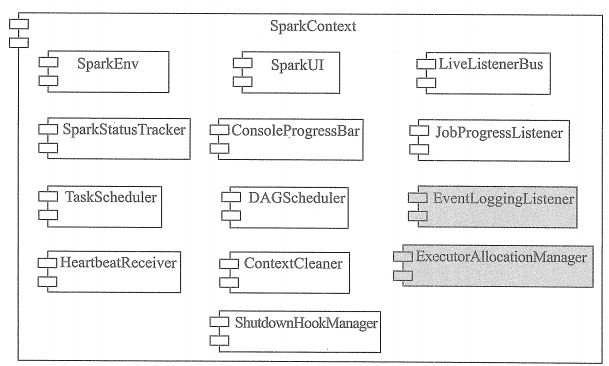

# SparkContext概述

SparkContext的初始化过程实际也是对Driver的初始化，这一准备工作是Spark应用程序提交与执行的前提。

SparkContext的初始化过程囊括了内部各个组件的初始化与准备，这些组件具有不同的功能，他们涉及网络通信、分布式、消息、存储、计算、缓存、度量、清理、文件服务、Web UI的方方面面。

# SparkContext的初始化

* **SparkEnv** : Spark运行时环境。Executor是处理任务的执行器，它依赖于SparkEnv提供的运行时环境。此外，在Driver中也包含了SparkEnv，这是为了保证loca模式下任务的执行。SparkEnv内部包含了很多组件，例如，serializerManager、RpcEnv、BlockManager、mapOutputTracker等。

* **LiveListenerBus** ：Spark中的事件总线，可以接受各个使用方的事件，并且通过异步方式对事件进行匹配后调用SparkListener的不同方法。

* **SparkUI** ：Spark的用户界面。

* **SparkStatusTracker** ： 提供对作业、Stage等的监控信息。

* **ConsoleProgressBar** ： 利用SparkStatusTracker的API，在控制台展示Stage的进度。

* **DAGScheduler** : DAG调度器，是调度系统中的重要组件之一，负责创建Job，将DAG中的RDD划分到不同的Stage、提交Stage等。

* **TaskScheduler** ： 任务调度器，是调度系统中的重要组件之一。TaskScheduler按照调度算法对集群管理器已经分配给应用程序的资源进行二次调度后分配给任务。TaskScheduler调度的Task是由DAGScheduler创建的，所以DAGSCheduler是TaskScheduler的前置调度。

* **HeartbeatReceiver** : 心跳接收器。所有Executor都会向HeartbeatReceiver发送心跳信息，HeartbeatReceiver接收到Executor的心跳信息后，首先更新Executor的最后可见时间，然后将此信息交给TaskScheduler做进一步处理。

* **ContextCleaner** ：上下文清理器。ContextCleaner实际用异步方式清理那些超出应用作用域的RDD、ShuffleDependency、Broadcast等信息。

* **JobProgressListener** : 作业进度监听器。

* **EventLoggingListener** : 将事件持久化到存储的监听器

* **ExecutorAllocationManager** : Executor动态分配管理器。顾名思义，可以根据工作负载动态调整Executor的数量。

* **ShutdownHookManager** : 用于设置关闭钩子的管理器。可以给应用设置关闭钩子，这样就可以在JVM进程退出时，执行一些清理工作。

