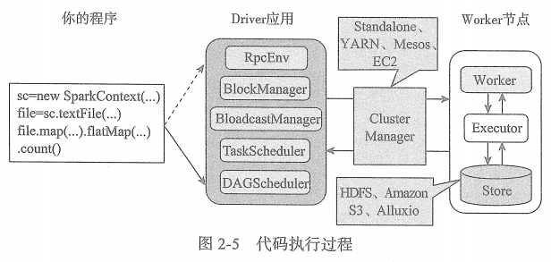
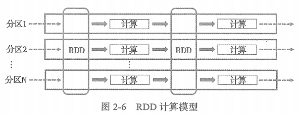
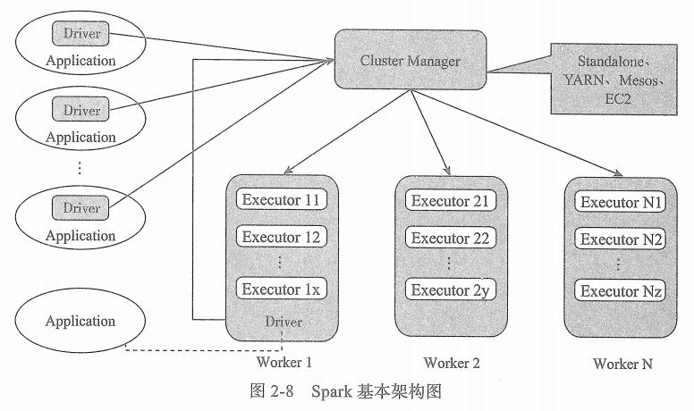

# Spark核心功能

Spark Core中提供了Spark最基础与最核心的功能，主要包括以下几项。

* **1.基础设施(SparkConf、Spark RPC框架、ListenerBus、度量系统)**

    ① SparkConf用于管理Spark应用程序的各种配置信息

    ② Spark内置的RPC框架使用Netty实现，有同步和异步的多种实现，Spark各个组件间的通信都依赖于此RPC框架。

    ③ 如果说RPC框架是跨机器节点不同组件间的通信设施，那么事件总线就是SparkContext内部各个组件间使用事件-监听器模式异步调用的实现

    ④ 度量系统由Spark中的多种度量源(Source)和多种度量输出(Sink)构成,完成对整个Spark集群中各个组件运行期状态的监控。

* **2.SparkContext**

    Spark应用程序的提交与执行都离不开SparkContext的支持。在正式提交应用程序之前，首先需要初始化SparkContext。

    SparkContext隐藏了网络通信、分布式部署、消息通信、存储体系、计算引擎、度量系统、文件服务、Web UI等内容，应用程序开发者只需要使用SparkContext提供的API完成功能开发。

* **3.SparkEnv**

    Spark执行环境SparkEnv是Spark中的task运行所必须的组件。

    SparkEnv内部封装了RPC环境（RpcEnv）、序列化管理器、广播管理器(BroadcastManager)、map任务输出跟踪器(MapOutputTracker)、存储体系、度量系统、输出提价协调器          (OutputCommitCoordinator)等Task运行所有需要的各种组件。

* **4.存储体系**

    Spark的内存存储空间与执行存储空间之间的边界可以是"软"边界。

    Spark的内存空间还提供了Tungsten的实现，直接操作操作系统的内存。由于Tungsten省去了在堆内分配Java对象，因此能更加有效地利用系统的内存资源。

* **5.调度系统**

    调度系统主要由DAGScheduler和TaskScheduler组成，他们都内置在SparkContext中。

    DAGScheduler负责创建job、将DAG中的RDD划分到不同的Stage、给Stage创建对应的Task、批量提交Task等功能。

    TaskScheduler负责按照FIFO或者FAIR等调度算法对批量Task进行调度、为task分配资源、将Task发送到集群管理器的当前应用的Executor上，由Executor负责执行等工作。

* **6.计算引擎**

    计算引擎由内存管理器(MemoryManager)、Tungsten、任务管理器(TaskMemoryManager)、Task、外部排序器(ExeternalSorter)、Shuffle管理器(ShuffleManager)等组成。

    MemoryManager除了对存储体系中的存储内存提供支持和管理外，还为计算引擎中的执行内存提供支持和管理。

    Tungsten除用于存储外，也可以用于计算或执行。

    TaskMemoryManager对分配给单个Task的内存资源进行更细粒度的管理和控制。

    ExternalSorter用于在map端或者reduce端对ShuffleMapTask计算得到的中间结果进行排序、聚合等操作。

    ShuffleManager用于将各个分区对应的ShuffleMapTask产生的中间结果持久化到磁盘，并在reduce端按照分区远程拉取ShuffleMapTask产生的中间结果。

# Spark模型设计

## 1. Spark编程模型
**Spark应用程序从编写到提交、执行、输出的整个过程如下图所示：**

**Spark编程模型的关键环节，其步骤如下：**
1. 用户使用SparkContext提供的API编写Driver应用程序

2. ① 使用SparkContext提交的用户应用程序。  

    ②首先会通过RpcEnv向集群管理器(Cluster Manager)注册应用(Application)并且告知集群管理器需要的资源数量。  
    
    ③集群管理器根据Application的需求，给Application分配Executor资源，并在Worker上启动CoarseGrainedExecutorBackend进程（该进程内部将创建Executor）。    
    
    ④Executor所在的CoarseGrainedExecutorBackend进程在启动的过程中将通过RpcEnv直接向Driver注册Executor的资源信息，TaskScheduler将保存已经分配给应用的Executor资源的地址、大小等信息。    
    
    ⑤然后，SparkContext根据各种转换API，构建RDD之间的血缘关系和DAG，RDD构成的DAG将最终提交给DAGSCheduler。    
    
    ⑥DAGScheduler给提交的DAG创建Job，并根据RDD的依赖性质将DAG划分为不同的Stage。DAGScheduler根据Stage内RDD的Partition数量创建多个Task把那个批量提交给TaskScheduler。    
    
    ⑦TaskScheduler对批量的Task按照FIFO或FAIR调度算法进行调度，然后给Task分配Executor资源。    
    
    ⑧最后将Task发送给Executor有Executor执行。    
    
    ⑨SparkContext还会再RDD转换开始之前使用BlockManager和BroadcastManager将任务的Hadoop配置进行广播。   
    
3. 集群管理器(Cluster Manger)会根据应用的需求，给应用分配资源，即将具体任务分配到不同Worker节点上的多个Executor来处理任务的运行。    

4. Task在运行的过程中需要对一些数据(如中间结果、检查点等)进行持久户。  

## 2. RDD计算模型

RDD可以看做是对各种数据计算模型的统一抽象，Spark的计算过程主要是RDD的迭代计算过程，如下图所示。RDD的迭代计算过程非常类似于管道。分区数量取决于Partition数量的设定，每个分区的数据只会在一个Task中计算。所有分区可以在多个机器节点的Executor上并行执行。

# Spark基本架构
从集群部署的角度来看，Spark集群有集群管理器(Cluster Manager)、工作节点(Worker)、执行器(Executor)、驱动器(Driver)、应用程序(Application)等部分组成，它们之间的整体关系如下图所示：

* **1.Cluster Manager**
    Spark的集群管理器，主要负责对整个集群资源的分配与管理。Cluster Manager分配的资源属于一级分配，他将各个Worker上的内存、CPU等资源分配给Application，但是并不负责对Executor的资源分配。Standalone部署模式下的Master会直接给Application分配内存、CPU及Executor等资源。

* **2.Worker**  
    Spark的工作节点。Worker节点主要工作：将自己的内存、CPU等资源通过注册机制告知Cluster Manager；创建Executor；将资源和任务进一步分配给Executor；同步资源信息、Executor状态信息给Cluster Manager等。在Standalone部署模式下，Master将Worker上的内存、CPU及Executor等资源分配给Application后，将命令Worker启动CoarseGrainedExecutorBackend进程(此进程会创建Executor实例)

* **3.Executor**
    执行计算任务的一线组件。主要负责任务的执行及Worker、Driver的信息同步。

* **4.Driver**
    Application的驱动程序，Application通过Driver与Cluster Manager、Executor进行通信。Driver可以运行在Application中，也可以由Application提交给Cluster Manager并由Cluster Manager安排Worker运行。

* **5.Application**
    用户使用Spark提供的API编写的应用程序，Application通过Spark API将进行RDD的转换和DAG的构建，并通过Driver将Application注册到Cluster Manager。Cluster Manger将会根据Application的资源需求，通过一级分配将Executor、内存、CPU等资源分配给Application。Driver通过二级分配将Executor等资源分配给每一个任务，Application最后通过Driver告诉Executor运行任务

