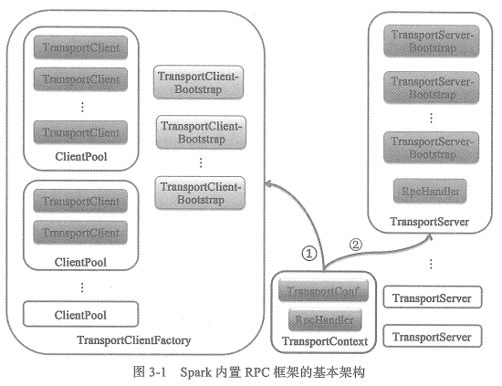
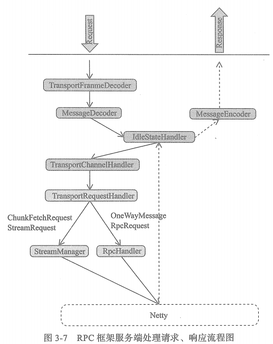
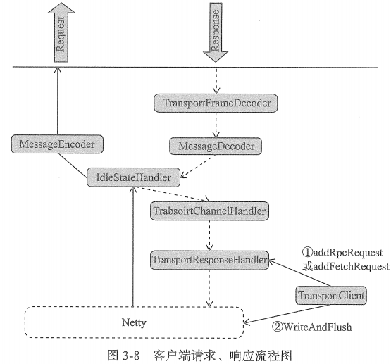

RPC框架的基本架构图：

* TransportContext内部包含传输上下文的配置信息TransportConf 和 对客户端请求消息进行处理的RpcHandler。TransportConf在创建TransportClientFactory 和 TransportServer 时都是必须的，而RpcHandler只用于创建TransportServer。

* TransportClientFactory是RPC客户端的工厂类。

* TransportServer是RPC服务端的实现。

* 记号①表示通过TransportContext的CreateClientFactory方法创建传输客户端工厂TransportClientFactory 的实例。在构造TransportClientFactory 的实例时，还会传递客户端引导程序TransportClientBootstrap的列表。此外，TransportClientFactory 内部存在针对每个Socket地址的连接池ClientPool。

* 记号②表示通过调用TransportContext的createServer方法创建传输服务端TransportServer的实例。在构造TransportServer的实例时，需要传递TransportContext、host、RpcHandler即服务端引导程序TransportServerBootstrap的列表。

* **TransportContext** ：传输上下文，包含了用于创建传输服务端(TransportServer)和传输客户端工厂(TransportClientFactory)的上下文信息，并支持使用TransportChannelHandler设置Netty提供的SocketChannel的Pipeline的实现。

* **TransportConf** : 传输上下文的配置信息。

* **Rpc** ：对调用传输客户端(TransportClient)的sendRPC方法发送的消息进行处理的程序。

* **MessageEncoder** : 在将消息放入管道前，先对消息内容进行编码，防止管道另一端读读取时丢包和解析错误。

* **MessageDecoder** ：对从管道中读取的ByteBuf进行解析，防止丢包和解析错误。

* **TransportFrameDecoder** ：对从管道中读取的ByteBuf按照数据帧进行解析。

* **RpcResponseCallback** ：RpcHandler对请求的消息处理完毕后进行回调的接口。

* **TransportClientFactory** : 创建TransportClient的传输客户端工厂类。

* **ClientPool** ：在两个对等节点间维护的关于TransportClient的池子。ClientPool是TransportClientFactory的内部组件。

* **TransportClient** ：RPC框架的客户端，用于获取预先协商好的流中的连续块。

* **TransportClientBootstrap** : 当服务端响应客户端连接时在客户端执行一次的引导程序。

* **TransportRequestHandler** ：用于处理客户端的请求并在写完块数据后返回的处理程序。

* **TransportResponseHandler** ：用于处理服务端的响应，并对发出请求的客户端进行响应的处理程序。

* **TransportChannelHandler** ：代理由TransportRequestHandler处理的请求和由TransportResponseHandler处理的响应，并加入传输层的处理。

* **TransportServerBootStrap** ：当客户端连接到服务端时在服务端执行一次的引导程序。

* **TransportServer** ：RPC框架的服务端，提供高效的、低级别的流服务。

## RPC框架服务端处理请求、响应流程图

TransportServerBootstrap将可能存在于图中任何两个组件的箭头连线中间，起到引导、包装、代理的作用。

## RPC框架客户端请求、响应流程图

①表示调用TransportResponseHandler的addRpcRequest方法(或addFetchRequest方法)，将更新最后一次请求的时间为当前系统时间，然后将requestId与RpcResponseCallback之间的映射加入到outstandingFetches缓存中。

②表示调用Channel的writeAndFlush方法将RPC请求发送出去。

图中虚线表示当TransportResponseHandler处理RpcResponse和RpcFailure时，将从outstandingRpcs缓存中获取此请求对应的RpcResponseCallack,并执行回调。

TransportClientBootstrap将可能存在于图中任何两个组件的箭头中间。

