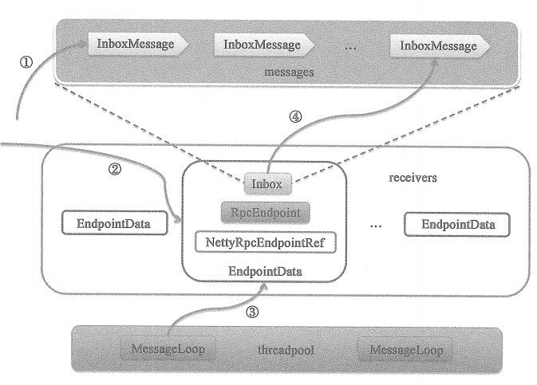
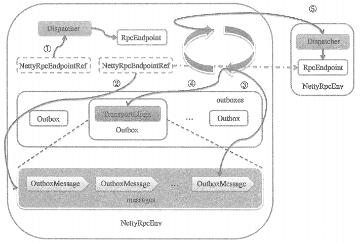

# Dispatcher中MessageLoop线程的执行流程

①表示调用Inbox的post方法将消息放入message列表中。
②表示将有消息的Inbox相关联的EndpointData放入receivers.
③表示MessageLoop每次循环首先从receivers中获取EndpointData。
④表示执行EndpointData中Inbox的的process方法对消息进行具体处理。

# RPC客户端发送请求示意图

上图展示了两个不同节点上的NettyRpcEnv。右边的NettyRpcEnv采用简略的表示方法，只展示了其内部的Dipatcher组件，实际上右边的NettyRpcEnv与左边的NettyRpcEnv在结构和组成上是一样的。除了Dispatcher组件，还展示了NettyRpcEnv内部的outboxes列表。左边NettyRpcEnv中的NettyRpcEndpointRef和右边一个提供服务的RpcEndpoint之间有箭头的虚线表示NettyRpcEndpointRef引用RpcEndpoint，也就是说NettyRpcEndpointRef知道RpcEndpoint的地址信息。

①表示通过调用NettyRpcEndpointRef的send和ask方法向本地节点的RpcEndpoint发送消息。由于是在同一节点，所以直接调用Dispatcher的postLocalMessage或postOneWayMessage方法将消息放入EndpointData内部Inbox的messages列表中。MessageLoop线程最后处理消息，并将消息发给对应的RpcEndpoint处理。

②表示通过调用NettyRpcEndpointRef的send和ask方法向远端节点的RpcEndpoint发送消息。这种情况下，消息将首先封装为Outboxmessage，然后放入到远端RpcEndpoint的地址对用的Outbox的message列表中。

③表示每个Outbox的drainOutbox方法通过循环，不断从messages列表中取得OutboxMessage.

④表示每个Outbox的drainOutbox方法使用Outbox内部的TransportClient向远端的NettyRpcEnv发送序号③中取得的OutboxMessge.

⑤表示序号④发出的请求在远端NettyRpcEnv的TransportServer建立了连接后，请求消息首先经过Netty管段的处理，然后经过NettyRpcHandler处理，最后NettyRpcHandler的receive方法会调用Dispatcher的postRemoteMessage或postOneWayMessage方法，将消息放入EndpointData内部Inbox的message列表汇总，MessageLoop线程最后处理消息，并将消息发给对应的RpcEndpoint处理。

