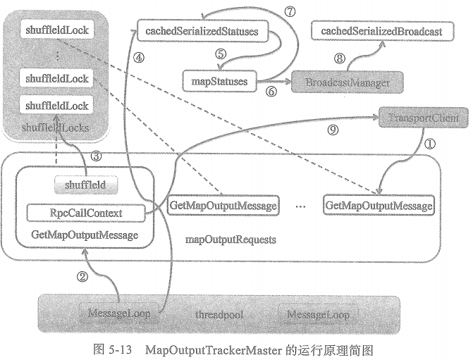
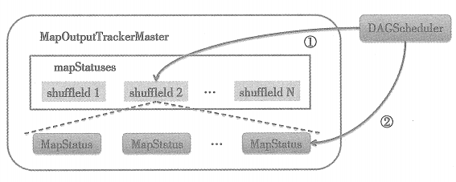

# mapOutputTracker

mapOutputTracker用于跟踪map任务的输出状态，此状态便于reduce任务定位map输出结果所在的节点地址，进而获取中间输出结果。每个map任务或者reduce任务都会有其唯一标识，分别为mapId和reduceId。每个reduce任务的输入可能是多个map任务的输出，reduce会到各个map任务所在节点上拉取Block, 这一过程叫做Shuffle。每次Shuffle都有唯一的标识shuffleId。

①表示某个Executor调用MapOutputTrackerWorker的getStatuses方法获取某个shuffle的map任务状态信息，当发现本地的mapStatuses没有相应的缓存，则调用askTracker方法发送GetMapOutputStatuses消息。askTracker实际是通过MapOutputTrackerMasterEndpoint的NettyRpcEndpointRef向远端发送GetMapOutputStatuses消息。发送实际依托于NettyRpcEndpointRef持有的TransportClient。MapOutputTrackerMasterEndpoint在接收到GetMapOutputStatuses消息后，将GetMapOutputStatuses消息放入mapOutputRequests队尾。

②表示MessageLoop线程从mapOutputRequests队头取出GetMapOutputStatuses.

③表示从shuffleIdLocks数组中取出与当前GetMapOutputStatuses携带的shuffleId对应的锁。

④表示首先从cacheSerializedStatuses缓存中获取shuffleId对应的序列化任务状态信息

⑤表示当cacheSerializedStatuses中没有shuffleId对应的序列化任务状态信息，则获取mapStatuses中缓存的shuffleId对应的任务状态数组。

⑥表示将任务状态数组序列化，然后使用BroadcastManager对序列化的任务状态进行广播。

⑦表示将序列化的任务状态放入cacheSerializedStatuses缓存中。

⑧表示将广播对象放入cacheSerializedBroadcast缓存中。

⑨表示将获得的序列化任务状态信息，通过回调GetMapOutMessage消息携带的RpcCallContext的reply方法回复客户端。

# Shuffle的注册流程

①表示DAGScheduler在创建了ShuffleMapStage后，调用MapOutputTrackerMaster的registerShuffle方法向mapStatuses缓存注册shuffleId.

②表示DAGScheduler处理ShuffleMapTask的执行结果时，如果发现ShuffleMapTask所属的ShuffleMapStage中每一个分区的ShuffleMapTask都执行成功了，那么将调用MapOutputTrackerMaster的registerMapOutputs方法，将ShuffleMapStage中每一个ShuffleMapTask的MapStatus保存到shuffleId对应的MapStatus数组中。

