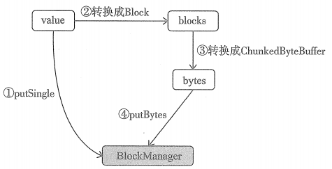
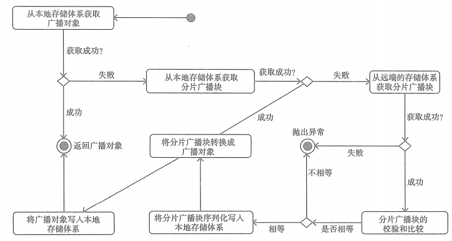

# BroadcastManager

BroadcastManager用于将配置信息和序列化后的RDD、Job 及 ShuffleDependency等信息在本地存储。

## 广播对象的写入

①调用BlockManager的putSingle方法将广播对象写入本地的存储体系

②调用TorrentBroadcast.blockifyObject方法，将对象转换成一系列的块。

③对每个块进行如下处理：1.给分片广播块生成校验和 2.给当前分片广播块生成分片 3.获取当前块数据

④将分片广播块以序列化方式写入Driver本地的存储体系。

## 广播对象的读取

