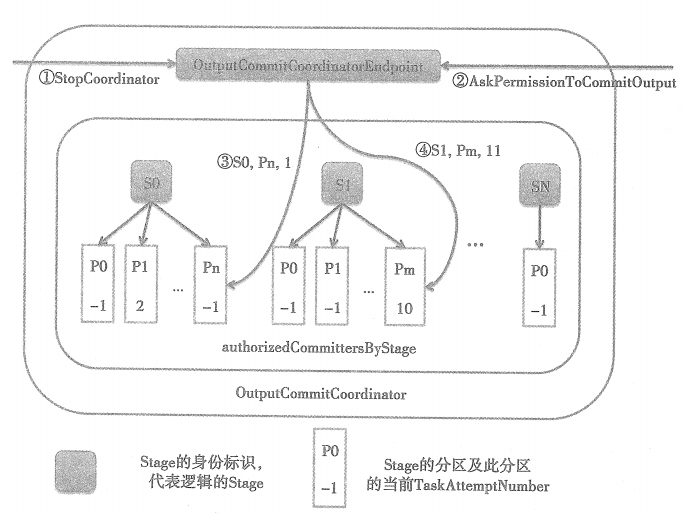

# OutputCommitCoordinator工作原理

上图展示了OutputCommitCoordinator的逻辑结构和工作原理。authorizedCommittersByStage缓存了每一个Stage及其分区的内存结构，S0、S1及SN代表不同Stage吗，P0、P1则代表Stage的各个分区，Pn、Pm说明每个Stage内的分区数量是不同。图中每个序号的含义如下。

①表示OutputCommitCoordinatorEndpoint收到StopCoordinator消息，OutputCommitCoordinatorEndpoint将调用父类RpcEndpoint的Stop方法，RpcEndpoint的stop方法实际又调用了NettyRpcEnv的Stop方法，停止OutputCommitCoordinatorEndpoint的工作。

②表示OutputCommitCoordinatorEndpoint在接收到AskPermissionToCommitOutput消息后，调用OutputCommitCoordinator的handleAskPermissionToCommit方法判断给定的任务尝试是否有权限将给定Stage的指定分区的数据提交到HDFS。

③表示AskPermissionToCommitOutput消息携带的Stage为S0，分区为Pn，任务尝试号为1，handleAskPermissionToCommit方法执行时发现阶段S0的分区Pn还未有任务尝试占用(即值为-1)，则允许当前任务尝试将阶段S0的分区Pn的数据提交到HDFS并且将Pn的值设置为1。

④表示AskPermissionToCommitOutput消息携带的Stage为S1，分区为Pm，任务尝试号为11，handleAskPermissionToCommit方法执行时发现阶段S1的分区Pm已被其他任务尝试占用(即值为10)，则不允许当前任务尝试将阶段S1的分区Pm的数据提交到HDFS。