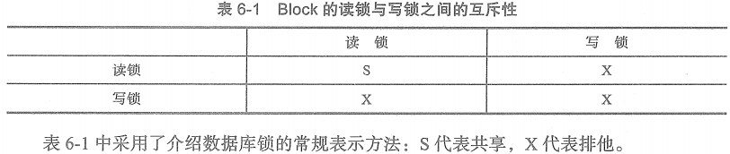
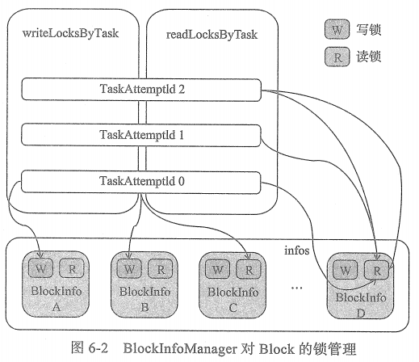

# BlockInfoManager

BlockInfoManager对BlockInfo进行了一些简单的管理，但是BlockInfoManager将主要对Block的锁资源进行管理。

## BlockInfoManager对Block的锁管理

BlockInfoManager对Block的锁管理采用了共享锁与排他锁，其中读锁是共享锁，写锁是排他锁。上表展示了Block的读锁与写锁之间的互斥性。

从上图，我们能直观的知道一下内容。

* 由TaskAttemptId 0 标记的任务尝试执行线程获取了BlockInfo A 和 BlockInfo B的写锁，并且程获取了BlockInfo C 和 BlockInfo D的写锁。

* 由TaskAttemptId 1 标记的任务尝试执行线程获取了BlockInfo D的读锁。

* 由TaskAttemptId 2 标记的任务尝试执行线程多次获取了获取了BlockInfo 的读锁，这说明Block的读锁是可以重入的。

由以上可以知道，一个任务尝试执行线程可以同时获得零到多个不同Block的写锁或获得零到多个不同Block的读锁，但是不能同时获得同一个Block的读锁与写锁。读锁是可以重入的，但是写锁不能重入。

