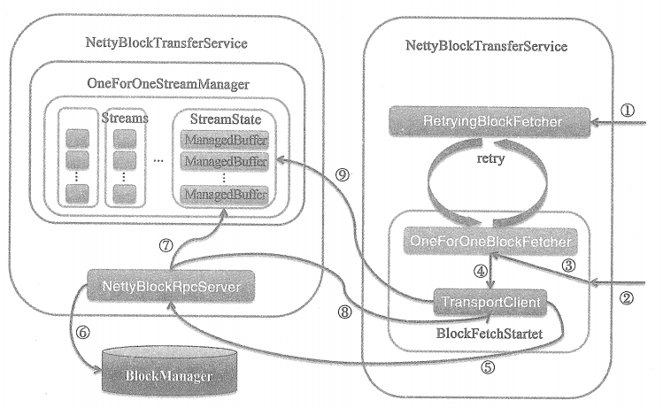
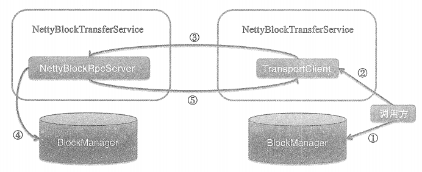

# Shuffle之Block的下载流程

①客户端调用ShuffleClient ( 默认为NettyBlockTransferService ) 的 fetchBlocks 方法下载远端节点的Block，由于指定spark.shuffle.io.maxRetries属性，所以调用RetryingBlockFetcher 的 start 方法。RetryingBlockFetcher 内部实际也是调用 BlockFetchStarter 的 createAndStart 方法，并且在发生IOException且重试次数 retryCount 小于最大重试次数 maxRetries 时，多次尝试调用  BlockFetchStarter 的 createAndStart 方法。

②客户端调用ShuffleClient(默认为NettyBlockTransferService)的fetchBlocks方法下载远端节点的Block，由于为指定spark.shuffle.io.maxRetries属性，所以将直接调用 BlockFetchStarter 的 createAndStart 方法。

③BlockFetchStarter 的 createAndStart 方法实际调用OneForOneBlockFetcher 的 Start 方法。

④OneForOneBlockFetcher 将调用 TransportClient 的 sendRpc 方法发送 OpenBlocks 消息。 OpenBlocks 携带着远端节点 appId、execId 和 blockIds（BlockId的数组）。此外， TransportClient 还将向 outstandingRpcs 中注册本次请求对应的匿名回调类 RpcResponseCallBack.

⑤NettyBlockRpcServer接收客户端发来的OpenBlocks 消息，并获取携带的BlockId 的数组信息。

⑥NettyBlockRpcServer对BlockId数组中的每个BlockId, 通过调用 BlockManager 的 getBlockData 方法获取数据块的信息 ( ManagedBuffer )，所有读取的Block 数据将构成一个ManagedBuffer类型的序列。

⑦NettyBlockRpcServer调用 OneForOneStreamManager 的 registerStream 方法生成 StreamId 和 StreamState 的映射关系缓存在 streams 中。StreamState 中将包含着 appId 和 ManagedBuffer序列。

⑧创建StreamHandle （包含着streamId 和 ManagedBuffer序列的大小），并通过回调方法将StreamHandle 封装为 RpcResponse，最后向客户端发送RpcResponse.

⑨TransportClient接收到RpcRespons消息后，从outstandingRpcs中查找到本次请求对应的匿名回调类 RpcResponseCallback，此 RpcResponseCallback 的 onSuccess 方法将 RpcResponse 消息解码为 StreamHandle, 并根据 StreamHandle 的 nunChunks（块数，即ManagedBuffer序列的大小）,按照索引逐个调用TransportClient 的 fetchChunk方法熊远端节点的缓存 streams 中找到与 streamId 对应的StreamState，并根据索引返回StreamState 的 ManagedBuffer 序列中的某一个 ManagedBuffer.

# Block 上传流程

①客户端从本地的BlockManager中读取BlockId对应的Block,并转换为ManagedBuffer类型

②客户端调用ShuffleClient（默认为NettyBlockTransferService）的 uploadBlock 方法上传Block到远端节点。 NettyBlockTransferService 进Block、Block 的存储级别及类型标记等信息进行序列化，生成metadata 和 array。

③NettyBlockTransferService 调用 TransportClient 的 sendRpc 方法发送UploadBlock消息。UploadBlock 携带着目标节点的 appId、execId、BlockId 及 metadata 和 array 等信息。 此外， TransportClient 还将向 outstandingRpcs 中注册本次请求对应的匿名回调类RpcResponseCallBack.

④NettyBlockRPCServer 接收到客户端发来的 UploadBlock消息，将UploadBlock 携带的 metadata 反序列化得到lock 的存储级别及类型标记，将UploadBlock 携带的Block数据( 即array )封装为NioManagedBuffer，最后调用 BlockManager 的putBlockData方法将 Block数据写入服务端本地的存储体系。

⑤NettyBlockRPCServer 将处理成功的结果返回给客户端，客户端从outstandingRpcs中查找到本次请求对应的匿名回调函数 RpcResponseCallBack 的onSuccess方法处理正确的响应。

