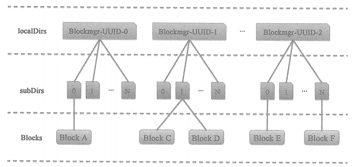

# DiskBlockManager

DiskBlockManager是存储体系的成员之一，它负责为逻辑的Block与数据写入磁盘的位置之间建立逻辑的映射关系。

# DiskBlockManager管理的文件目录结构

* localDirs数组 : 图中的一级目录名称都采用了简单的示意表示，例如，Blockmgr-UUID-0、Blockmgr-UUID-1、Blockmgr-UUID-2，代表每个文件夹名称有Blockmgr和UUID生成的随机串组成，且随机串不相同。

* subDirs：表示DiskBlockManager管理的二级目录，每个一级目录下都有N个二级目录，这里使用N代表subDirsPerLocalDir属性的大小。

* 每个二级目录下有若干个Block的文件，有些二级目录下可能暂时还没有BLock文件。