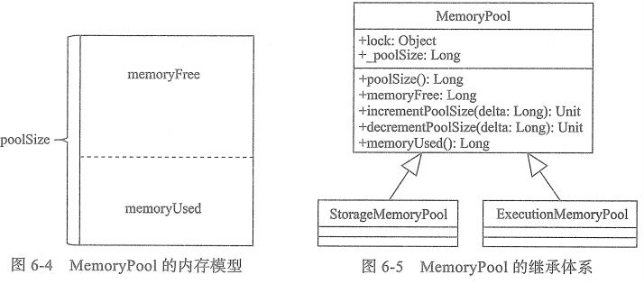
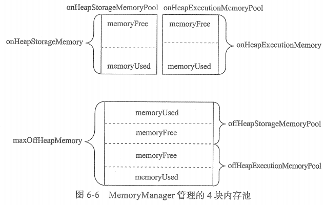
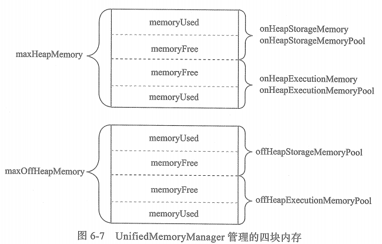

# MemoryPool模型
内存池好比游泳馆的游泳池，只不过游泳池装的是水，内存池装的是内存。游泳馆往往不止一个游泳池，Spark的存储体系的每个存储节点上也不止一个内存池。内存池实质上是对物理内存的逻辑规划，协助Spark任务在运行时合理地使用内存资源。Spark将内存从逻辑上区分为堆内存和堆外内存。这里的堆内存并不能与JVM中的Java堆直接画等号，它只是JVM对内存的一部分。堆外内存则是Spark使用sum.misc.Unsafe的API直接在工作节点的系统内存中开辟的空间。无论是那种内存，都需要一个内存池对内存进行资源管理，抽象类 MemoryPool定义了内存池的规范。

# MemoryManager

# UnifiedMemoryManager

以UnifiedMemoryManager作为默认的内存管理器。UnifiedMemoryManager提供了统一的内存管理机制，即Spark应用程序在运行期的存储内存和执行内存将共享统一的内存空间，可以动态调节两块内存的空间大小。UnifiedMemoryManager在MemoryManager的内存模型之上，将计算内存和存储内存之间的边界修改为“软”边界，即任何一方可以向另一方借用空闲的内存。

