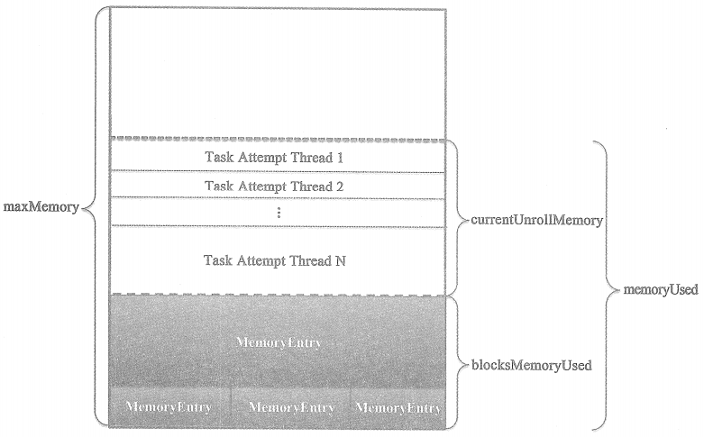

# MemoryStore内存模型

Spark将内存中的Block抽象为特质MemoryEntry
```
private sealed trait MemoryEntry[T] {
  def size: Long  // 当前Block的大小
  def memoryMode: MemoryMode // Block存入内存的内存模式
  def classTag: ClassTag[T] // Block的类型标记
}
```

# MemoryStore的内存模型

MemoryStore相比于MemoryManager，提供了一种宏观的内存模型，MemoryManager模型的堆内存和堆外内存在MemoryStore的内存模型中是透明的，UnifiedMemoryManager中存储内存与计算内存的“软”边界在MemoryStore的内存模型中也是透明的，读者应该时刻记着这些不同点。



从图中看出，整个MemoryStore的存储分为三块：

* 一块是MemoryStore的entries属性持有的很多MemoryEntry所占据的内存blocksMemoryUsed；

* 一块是onHeapUnrollMemoryMap或offHeapUnrollMemoryMap中使用展开方式占用的内存currentUnrollMemory。展开内存的目的是可以防止在内存真正写入数据时，内存不足发生溢出。blocksMemoryUsed 和 currentUnrollMemory的空间之和是已经使用的空间，即memoryUsed.

* 一块内存没有任何标记，表示未使用。


