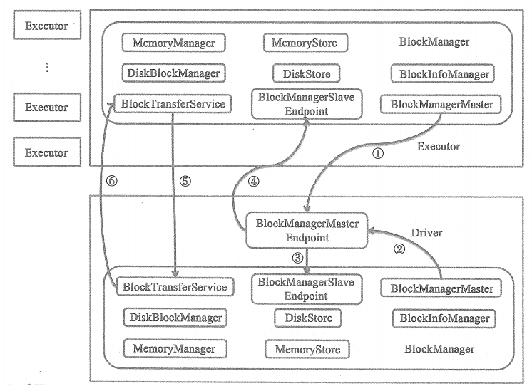

# 存储体系架构

如上图，BlockManager依托于很多组件的服务，这些组件包括以下几项。

* **1.BlockManagerMaster** : 代理BlockManager与Driver上的BlockManagerMasterEndpoint通信。图中记号①表示Executor节点上的BlockManager通过BlockManagerMaster与BlockManagerMasterEndpoint进行通信，记号②表示Driver节点上的BlockManager通过BlockManagerMaster与BlockManagerMasterEndpoint进行通信。这些通信的内容有很多，**例如，注册BlockManager、更新Block信息、获取Block的位置(即Block所在的BlockManager)、删除Executor等。BlockManagerMaster之所以能够和BlockManagerMasterEndpoint通信，是因为它持有了BlockManagerMasterEndpoint的RpcEndpointRef.**

* **2.BlockManagerMasterEndpoint** : 由Driver上的SparkEnv负责创建和注册到Driver的RpcEnv中。BlockManagerMasterEndpoint只存在于Driver的SparkEnv中，Driver或Executor上的BlockManagerMaster的driverEndpoint属性将持有BlockManagerMasterEndpoint的RpcEndpointRef。**BlockManagerMasterEndpoint主要对各个节点上的BlockManager、BlockManager与Executor的映射关系 及 Block位置信息（即Block所在的BlockManager）等进行管理。**

* **3.BlockManagerSlaveEndpoint** : 每个Executor或Driver的SparkEnv中都有属于自己的BlockManagerSlaveEndpoint,分别有各自的SparkEnv负责创建和注册到各自RpcEnv中。Driver或Executor都存在各自的BlockManagerSlaveEndpoint，并由各自BlockManager的slaveEndpoint属性持有各自BlockManagerSlaveEndpoint的RpcEndpointRef。BlockManagerSlaveEndpoint将接收BlockManagerMasterEndpoint下发的命令。上图③表示BlockManagerMasterEndpoint向Driver节点上的BlockManagerSlaveEndpoint下发命令，④表示BlockManagerMasterEndpoint向Executor节点上的BlockManagerMasterEndpoint向Executor节点上的BlockManagerSlaveEndpoint下发命令。这些命令有很多，**例如，删除Block、获取Block状态、获取匹配的BlockId等。**

* **4.SerializerManager** : 序列化管理器。

* **5.MemoryManager** : 内存管理器。负责对单个节点上内存的分配与回收。

* **6.MapOutputTracker** : map任务输出跟踪器。

* **7.ShuffleManager** ：Shuffle管理器。

* **8.BlockTransferService** ： 块传输服务。此组件也与Shuffle相关联，主要用于不同阶段的任务之间的Block数据的传输与读写。例如，map任务所在节点的BlockTransferService给Shuffle对应的reduce任务提供下载map中间输出结果的服务。

* **9.ShuffleClient** : Shuffle的客户端。与BlockTransferService配合使用。上图中记号⑤表示Executor上的shuffleClient通过Driver上的BlockTransferService提供的服务上传和下载Block，记号⑥表示Driver上的shuffleClient通过Executor上的BlockTransferService提供的服务上传和下载Block。此外，不同Executor节点上的BlockTransferService和shuffleClient之间也可以互相上传、下载Block。

* **10.SecurityManager** ： 安全管理器。

* **11.DiskBlockManager** ：磁盘管理器。对磁盘上的文件及目录的读写操作进行管理。

* **12.BlockInfoManager** ： 块信息管理。负责对Block的元数据及锁资源进行管理。

* **13.MemoryStore** ： 内存存储。依赖于MemoryManager,负责对Block的内存存储。

* **14.DiskStore** ：磁盘存储。依赖于DiskBlockManager,负责对Block的磁盘存储。

