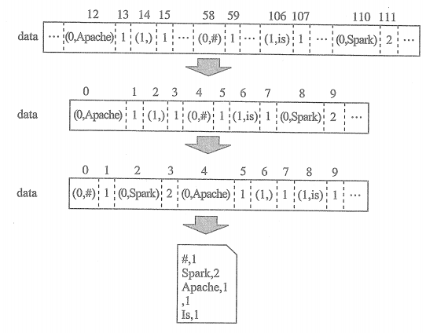
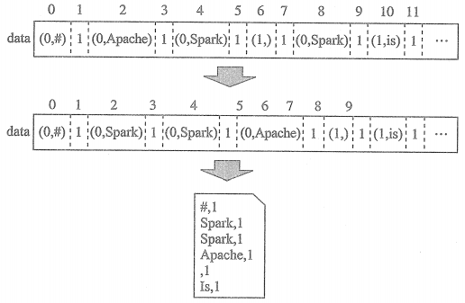
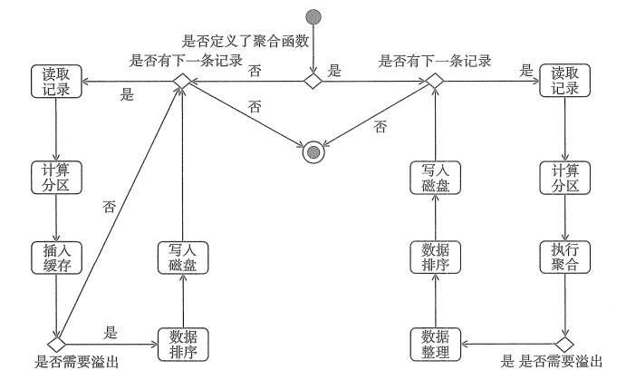
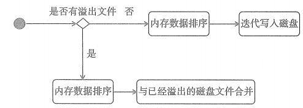
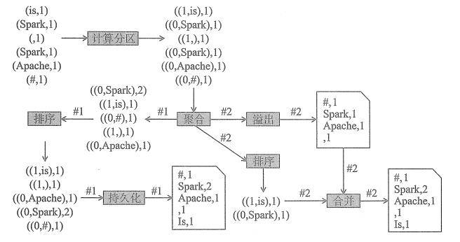

# ExternalSorter

## 1. PartitionedAppendOnlyMap的缓存溢出

上图表示PartitionedAppendOnlyMap底层data数组中的元素都是散列存储，执行缓存溢出的步骤如下：

* 1. 将data数组中的元素向低索引端整理。

* 2. 将data数组中的元素根据指定的比较器对元素进行排序。如果指定了聚合函数或者排序函数，那么排序先按照分区ID进行排序，然后按照key进行排序。

* 3. 将data数组中的数据通过迭代器写到磁盘文件。图中的磁盘文件的内容是从逻辑的角度描绘的，实际上并非是明文输出的。

## 2. PartitionedPairBuffer的缓存溢出

对于PartitionedPairBuffer而言，其底层data数组中的元素是在插入的收就排列整齐的，因此溢出过程中不会有整理操作，其余步骤与PartitionedAppendOnlyMap类似。

## 3 ExternalSorter 实现的 map端输出过程

## 4 map端输出的持久化

持久化有以下两种路径：

* 有溢出文件时，将溢出的分区文件与内存中的数据进行合并后写入磁盘

* 无溢出文件时，将内存中的数据进行整理、排序后写入磁盘

**无论哪种持久化执行过程，所有分区都会最终写入一个正式的Block文件，各个分区的数据按照分区ID和key进行排序输出到此文件中，所以每个map任务实际上最后只会发生成一个磁盘文件，最终解决了Spark早期版本中一个map任务输出的bucket文件过多和磁盘I/O成为性能瓶颈的问题。此外，无论哪种排序方式，每输出完一个分区的中间结果时，都会使用lengths数组记录当前分区的长度，此长度将记录在分区索引文件中，以便下游reduce任务的读取。**

## 5 map任务中间结果持久化的整体流程

经过对SizeTracker、WritablePartitionedPairCollection、AppendOnlyMap、partitionedPairBuffer、ExternalSorter的深入理解，可以用上图来表示ExternalSorter实现的将map任务的中间结果输出到磁盘的整个过程。

上图展示了在指定聚合函数后，map任务中间结果输出的整体流程。

* 1.map任务按照先后顺序分别输出了(#,1)、(Apache,1)、(Spark,1)、(,1)、(Spark,1)、(is,1)等六条记录。

* 2.在将数据更新到AppendOnlyMap前，计算每条记录的分区ID。

* 3.聚合的过程中可能不会产生溢出文件，因此数据都将保留在AppendOnlyMap底层的data数组中，按照分区ID和key排序后持久化到文件中。

* 4.如果将spark.shuffle.spill.numElementsForceSpillThreshold设置为4，那么产生一个溢出文件，再向AppendOnlyMap底层的data数据插入((1,is),1)和((0,Spark),1)两条记录后，由于未超过4，一次不会溢出，最后将溢出文件与内存中的两条记录进行合并，生成数据文件。

