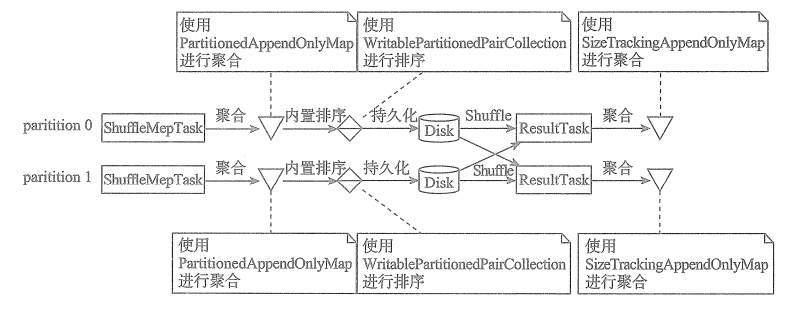
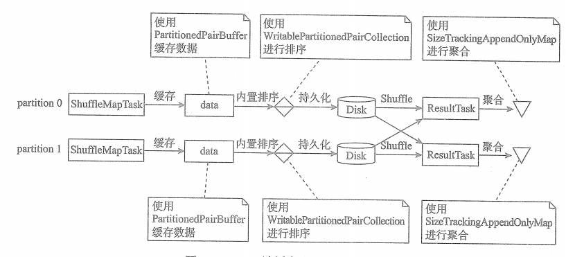
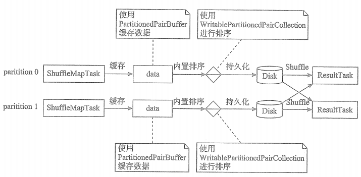
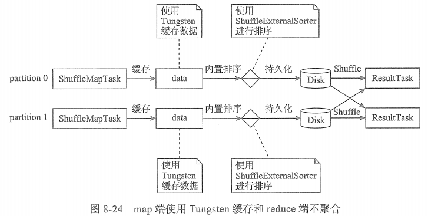
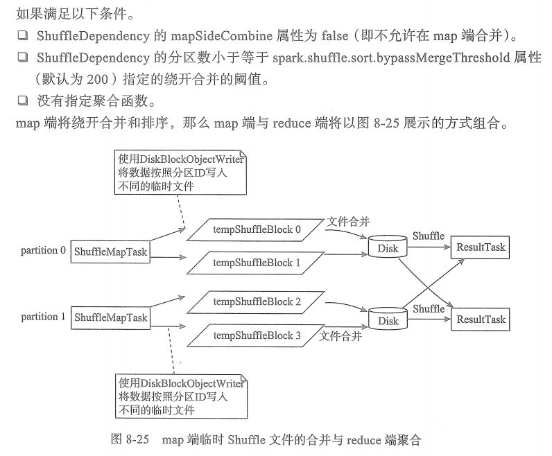

# map端与reduce端的Shuffle组合

## 1. map端和reduce端都进行聚合

**如果满足以下条件：**

* 1. ShuffleDependency 的 mapSideCombine 属性为 true (即允许在map端合并)。

* 2. 指定了聚合函数。

* 3. ShuffleDependency 不支持序列化。

那么map端和reduce端将以下图展示的方式组合。如果指定了排序函数，还会再reduce端聚合后进行排序。

## 2. map端缓存和reduce端聚合

**如果满足以下条件：**

* 1. ShuffleDependency 的 mapSideCombine 属性为 false (即不允许在map端合并)。

* 2. ShuffleDependency 的分区数大于spark.shuffle.sort.bypassMergeThreshold属性（默认为200）指定的绕开合并和排序的阈值。

* 3. ShuffleDependency 不支持序列化。

* 4. 指定了聚合函数。

那么map端与reduce端将以下图展示的方式组合。如果指定了排序函数，还会在reduce端聚合后进行排序。

## 3. map端缓存和reduce端不聚合

**如果满足以下条件：**

* 1. ShuffleDependency 的 mapSideCombine 属性为 false (即不允许在map端合并)。

* 2. ShuffleDependency 的分区数大于spark.shuffle.sort.bypassMergeThreshold属性（默认为200）指定的绕开合并和排序的阈值。

* 3. ShuffleDependency 不支持序列化。

* 4. 指定了聚合函数。

**此外，当ShuffleDependency 执行序列化，其他三个条件不变时， map 端将使用UnsafeShuffleWriter.**

## 4. map端绕开聚合、排序和reduce端不聚合

