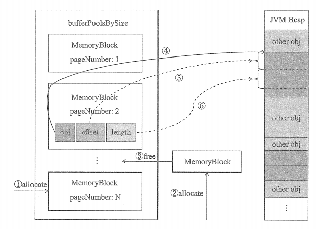
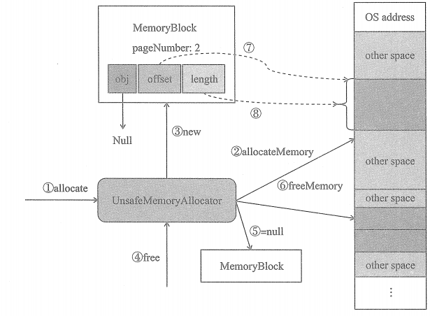
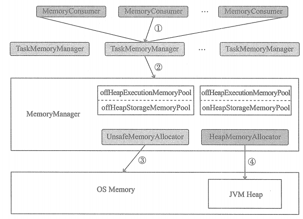

# 内存管理器与Tungsten

Tungsten是一种内存分配与释放的实现。Tungsten使用sun.misc.Unsafe的API直接操作系统内存，避免了在JVM中加载额外的Class，也不用创建额外的对象，因而减少了不必要的内存开销，降低了GC扫描和回收的效率，提升了处理性能。堆外内存可以被精确地申请和释放，而且序列化的数据占用的空间可以被精确计算，所以相比堆内存来说降低了管理难度，也降低了误差。

## HeapMemoryAllocator 的工作原理

①在分配MemoryBlock时，申请的大小大于等于1MB，且bufferPoolsBySize中存在指定大小的MemoryBlock,则从bufferPoolsBySize中获取MemoryBlock.

②在分配MemoryBlock时，申请的大小小于1MB，或者bufferPoolsBySize中不存在指定大小的MemoryBlock，则单独创建MemoryBlock用于分配。

③在释放MemoryBlock时，如果MemoryBlock的大小大于等于1MB，则将此MemoryBlock放入bufferPoolsBySize中。

④MemoryBlock的obj属性保存了对象在JVM堆中的地址

⑤MemoryBlock的offset属性保存了Page的起始地址（即相对于所在对象在JVM对中地址的偏移量）。

⑥MemoryBlock的length属性保存了Page的页面大小（即从offset开始，连续内存空间的大小）

## UnsafeMemoryAllocator的工作原理

①调用UnsafeMemoryAllocator 的 allocate 方法分配 MemoryBlock。

②UnsafeMemoryAllocator 调用 allocateMemory 方法请求操作系统分配内存

③操作系统分配了内存后， 将此块内存的地址信息返回给 UnsafeMemoryAllocator。UnsafeMemoryAllocator利用内存地址信息和内存大小创建 MemoryBlock， 此 MemoryBlock的 obj 属性为 null。

④调用UnsafeMemoryAllocator的free 方法释放MemoryBlock。

⑤在调用UnsafeMemoryAllocator的free方法之前，调用方已经将此memoryBlock 的引用设置为null。

⑥UnsafeMemoryAllocator调用sun.misc.Unsafe的freeMemory方法请求操作系统释放内存。

⑦MemoryBlock的offset属性保存了Page的操作系统内存中的地址。

⑧MemoryBlock的length属性保存了Page的页面大小（即从offset开始，连续内存空间的大小）。

## 执行内存的整体架构

通过对MemoryManager、ExecutionMemoryPool、Tungsten、MemoryAllocator、TaskMemoryManager、MemoryConsumer等组件的分析和总结。我们可以通过下图说明执行内存的整体架构。

上图从下往上展示了Spark执行内存的各个组成部分，上层的组件依赖于下层提供的服务或支持。OS Memory 是整个架构的基础，无论执行内存如何和分配，都离不开系统内存的支持。JVM 的堆内存（Heap）提供了对Java对象的存储支持，其实质依然是从操作系统申请获得的内存。MemoryManager提供了四种逻辑上的内存池，分别为offHeapExecutionMemoryPool、onHeapExecutionMemoryPool、offHeapStorageMemoryPool、onHeapStorageMemoryPool。MemoryManager提供了在tungsten的堆外内存上分配内存的UnsafeMemoryAllocator和在Tungsten的对内存上分配内存的HeapMemoryAllocator。UnsafeMemoryAllocator通过sun.misc.Unsafe的各种API操纵操作系统内存，HeapMemoryAllocator则通过在JVM heap 上分配对象的方式操作JVM Heap。由于每个节点只有一个MemoryManager，而每个任务尝试都会有一个TaskMemoryManager为其管理内存，所以多个TaskMemoryManager将分享MemoryManager管理的内存。每个TaskMemoryManager管理的任务内存又会有多个内存消费者进行消费。

①MemoryConsumer调用TaskMemoryManager提供的API，获取/释放 执行内存。

②TaskMemoryManager提供的API实际都依赖于MemoryManager的具体实现。MemoryManager通过offHeapExecutionMemoryPool、onHeapExecutionMemoryPool，分别对堆外内存和堆内内存进行逻辑操作。MemoryManager通过UnsafeMemoryAllocator和HeapMemoryAllocator，分别对堆外内存和堆内内存进行物理操作。

③UnsafeMemoryAllocator通过sun.misc.Unsafe的各种API操作系统内存。

④HeapMemoryAllocator通过在JVM Heap上分配对象的方式操纵JVM Heap

