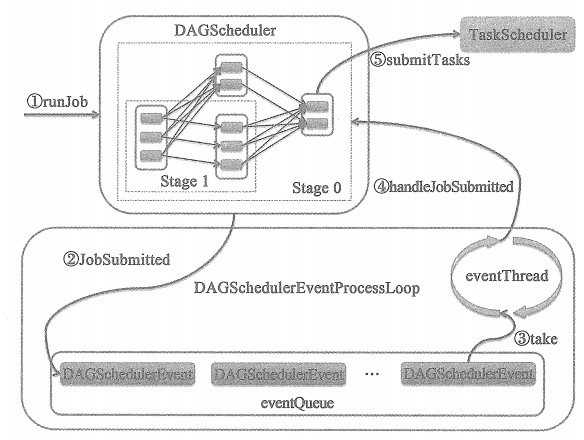

# DAGScheduler的调度流程

①表示应用程序通对Spark API的调用，进行一系列RDD转换构建出RDD之间的依赖关系后，调用 DAGScheduler 的 runJob 方法将RDD及其血缘关系中的所有RDD传递给 DAGScheduler 进行调度。

②DAGScheduler 的 runJob 方法实际通过调用 DAGScheduler 的 submitJob 方法向 DAGSchedulerEventProcessLoop 发送JobSubmitted 事件。DAGSchedulerEventProcessLoop 接收到 JobSubmitted 事件后， 将 JobSubmitted 事件放入事件队列（eventQueue）。

③DAGSchedulerEventProcessLoop 内部的轮询线程 eventThread 不断从时间队列（eventQueue）中获取DAGSchedulerEvent 事件，并调用DAGSchedulerEventProcessLoop 的 doOnReceive 方法对事件进行处理。

④DAGSchedulerEventProcessLoop 的 doOnReceive 方法处理JobSubmitted 时间时，将调用 DAGScheduler 的 handleJobSubmitted 方法。 handleJobSubmitted 方法将对 RDD 构建Stage 及 Stage 之间的依赖关系。

⑤DAGScheduler 首先把最上游的 Stage 中的 Task 集合提交给 TaskScheduler, 然后逐步将下游的 Stage 中的 Task 集合提交给 TaskScheduler。TaskScheduler 将对 Task集合进行调度。

