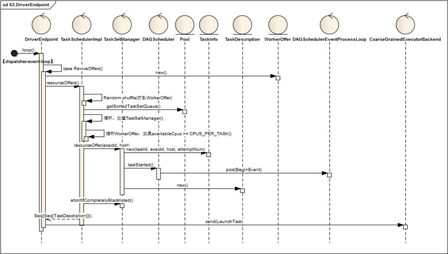

# Driver将TaskSetManager分解为TaskDescriptions并发布任务到Executor

Driver接受唤起消费指令后，将所有待处理的TaskSetManager与Driver中注册的Executor资源进行匹配，最终一个TaskSetManager得到多个TaskDescription对象，按照TaskDescription想对应的Executor发送LaunchTask指令



当Driver获取到ReviveOffers（请求消费）指令时

* 1. 	首先根据executorDataMap缓存信息得到可用的Executor资源信息（WorkerOffer），关键代码如下:
```
val activeExecutors = executorDataMap.filterKeys(executorIsAlive)
val workOffers = activeExecutors.map { case (id, executorData) =>
  new WorkerOffer(id, executorData.executorHost, executorData.freeCores)
}.toIndexedSeq

```