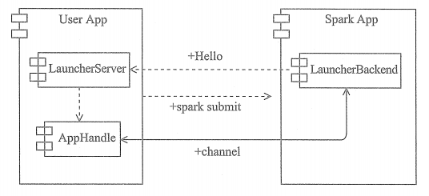
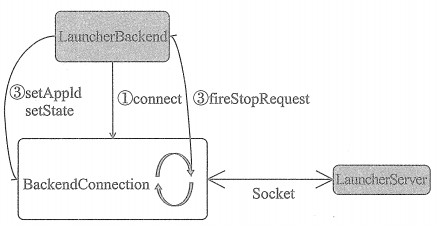

# LauncherBackend

## LauncherServer 的工作原理
要介绍LauncherBackend, 首先应该介绍下LauncherServer。当Spark应用程序没有在用户应用程序中运行，而是运行在单独的进程中时，用户可以在用户应用程序中使用LaucherServer 与 Spark 应用程序通信。LauncherServer将提供Socket连接的服务端，与Spark应用程序中的Socket连接的客户端通信。LauncherServer 的工作原理如下图所示：

## LauncherBackend的工作原理

由于TaskSchedulerImpl 的底层依赖于 LauncherBackend。LauncherBackend依赖于BackendConnection 跟 LauncherServer 进行同行。

①调用LauncherBackend 的 connect 方法创建BackendConnection， 并且创建线程执行BackendConnection。 构造BackendConnection 的工程中， BackendConnection 会和 LauncherServer 之间建立起 Socket连接。BackendConnection（实现了Runnable接口）将不断从Socket连接中读取 LauncherServer 发送的数据。

②调用LauncherBackend的setAppId方法 或者 setState 方法，通过 Socket 连接向 LauncherServer发送 SetAPPId 或 SetState 消息。

③BackendConnection 从 Socket 连接中读取到 LauncherServer 发送的Stop 消息， 然后调用LauncherBackend的 fireStopRequest 方法停止请求。

