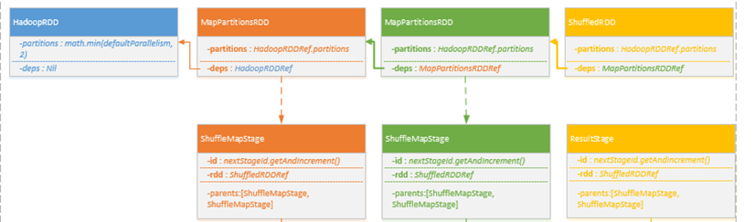

# RDD分解为待执行TaskSet

Job提交后，DAGScheduler根据RDD层次关系解析为对应的Stages，同时维护Job与Stage的关系。

将最上层的Stage根据并发关系（findMissingPartitions ）分解为多个Task，将这个多个Task封装为TaskSet提交给TaskScheduler。非最上层的Stage的存入处理的列表中（waitingStages += stage）

**流程如下：**


* 1.DAGSchedulerEventProcessLoop中，线程【dag-scheduler-event-loop】处理到JobSubmitted
    
    a) 划分Stage
    
    

* 2.调用DAGScheduler进行handleJobSubmitted
    
    a)	首先根据RDD依赖关系依次创建Stage族,Stage分为ShuffleMapStage，ResultStage两类
    

    b)	更新jobId与StageId关系Map

    c)	创建ActiveJob，调用LiveListenerBus，发送 SparkListenerJobStart 指令

    d)	找到最上层Stage进行提交，下层Stage存入waitingStage中待后续处理
        
        i.	调用OutputCommitCoordinator进行stageStart()处理
        ii.	调用LiveListenerBus， 发送 SparkListenerStageSubmitted指令
        iii.	调用SparkContext的broadcast方法获取Broadcast对象,根据Stage类型创建对应多个Task，一个Stage根据findMissingPartitions分为多个对应的Task，Task分为ShuffleMapTask


    iv.	将Task封装为TaskSet，调用TaskScheduler.submitTasks(taskSet)进行Task调度，关键代码如下：
```
taskScheduler.submitTasks(new TaskSet(
        tasks.toArray, stage.id, stage.latestInfo.attemptId, jobId, properties))
```