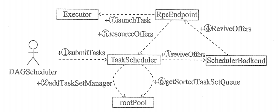

# TaskSchedulerImpl调度流程

上图从抽象的角度描绘了 TaskSchedulerImpl的调度流程，使用了SchedulerBackend，而不是SchedulerBackend 的具体实现，RpcEndpoint 代表SchedulerBackend 的具体实现中与其他组件进行通信的实例(如 LocalSchedulerBackend中的 LocalEndpoint)。

①代表DAGScheduler 调用 TaskScheduler 的submitTasks 方法向 TaskScheduler 提交 TaskSet.

②代表 TaskScheduler接收到 TaskSet后，创建对此TaskSet进行管理的 TaskSetManager， 并将TaskSetManager通过调度池构建器添加到根调度池中。

③代表TaskScheduler调用SchedulerBackend的 reviveOffers 方法给Task提供资源。

④SchedulerBackend向 RpcEndpoint 发送ReviveOffers消息。

⑤RpcEndpoint 将调用TaskScheduler 的resourceOffers 方法给 Task 提供资源。

⑥TaskScheduler调用根调度池的getSortedTaskSetQueue 方法对所有 TaskSetManager 按照调度算法进行排序后，对TaskSetManager管理的Task进行序列化、生成TaskDescription等。

⑦调用Executor 的 launchTask 方法运行Task尝试