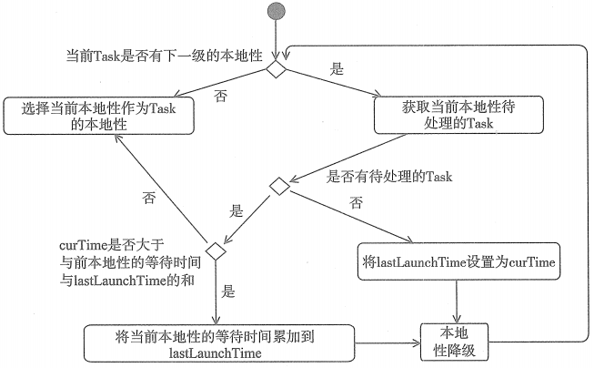

# TaskSetManager

TaskSetManager 也实现了Schedulable 特质，并参与到调度池的调度中。TaskSetManager 对TaskSet 进行管理， 包括任务推断、Task本地性、并对Task进行资源分配。TaskSchedulerImpl 依赖于TaskSetManager。

# TaskSetManager推断执行
Pool 和 TaskSetManager 中对推断执行的操作分为两类：
* 一类是可推断任务的检测与缓存（Pool 和 TaskSetManager 的 checkSpeculatableTasks 方法实现了按照深度遍历算法对可推断任务的检测与缓存）
* 另一类是从缓存中找到可推断任务进行推断执行（TaskSetManager 的 dequeueSpeculative方法则实现了从缓存中找到可推断任务进行推断执行）

# 获取允许的本地性级别

经过对Spark任务本地性的分析后，可能觉得这样的代码实现有些过于复杂，并且在获取本地性级别的时候竟然每次都要等待一段本地性级别的等待时长，这种实现未免太过奇怪。因为任何任务都希望被分配到可以从本地读取数据的节点上，已得到最大的性能提升。然而每个任务的运行时长都不是事先可以预料的，当一只固执地期盼得到最佳的资源，很有可能被已经占用最佳资源但是运行时间很长的任务耽搁，所以这些代码实现了没有最佳本地性时，对而求其次，悬着稍微差点的资源。