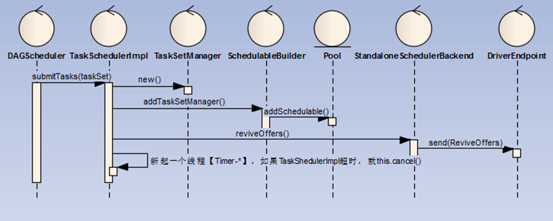

# TaskSet封装为TaskSetManager并提交至Driver

TaskScheduler 将 TaskSet 封装为 TaskSetManager(new TaskSetManager(this, taskSet, maxTaskFailures, blacklistTrackerOpt)),存入待处理任务池（Pool）中，发送DriverEndpoint唤起消费（ReviveOffers）指令



* 1. DAGSheduler将TaskSet提交给TaskScheduler的实现类，这里是TaskChedulerImpl，关键代码如下：
```
 taskScheduler.submitTasks(new TaskSet(tasks.toArray, stage.id, stage.latestInfo.attemptId, jobId, properties))
```

* 2. TaskSchedulerImpl创建一个TaskSetManager管理TaskSet，关键代码如下：
```
private[scheduler] def createTaskSetManager(
      taskSet: TaskSet,
      maxTaskFailures: Int): TaskSetManager = {
    new TaskSetManager(this, taskSet, maxTaskFailures)
  }
```

* 3. 同时将TaskSetManager添加SchedduableBuilder的任务池Pool中, 关键代码如下：
```
schedulableBuilder.addTaskSetManager(manager, manager.taskSet.properties)
```

* 4. 调用SchedulerBackend的实现类进行reviveOffers，这里是standlone模式的实现类StandaloneSchedulerBackend，关键代码如下：
```
// 调用SchedulerBanckend的reviveOffers方法给Task分配资源并运行Task
backend.reviveOffers()
```

* 5. SchedulerBackend发送ReviveOffers指令至DriverEndpoint


