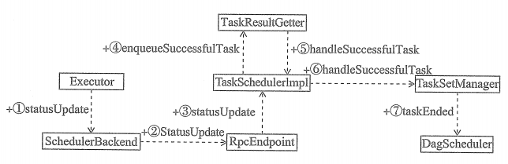

# Task执行结果的处理流程

①Executor 中的TaskRunner 在执行Task的过程中，不断将Task的状态通过调用 ExecutorBackend 的实现类的 statusUpdate方法告诉SchedulerBackend的实现类。当Task执行成功后， TaskRunner也会将Task的完成状态告诉SchedulerBackend的实现类。

②代表SchedulerBackend的实现类将Task的完成状态封装为 StatusUpdate消息发送给RpcEndpoint 的是新类（比如LocalEndpoint 或 Standalone模式下的DriverEndpoint)。

③RpcEndpoint 的实现类接收到StatusUpdate消息后，将调用TaskSchedulerImpl 的 statusUpdate 方法。

④TaskSchedulerImpl 的 statusUpdate 方法发现Task是执行成功的状态，那么调用 TaskResultGetter 的 enqueueSuccessfulTask方法。

⑤TaskResultGetter 的 enqueueSuccessfulTask方法对 DirectTaskResult 类型的结果进行反序列化得到Task执行结果， 对于IndirectTaskResult类型的结果需要从远端下载 Block 数据，然后再进行反序列化得到Task执行结果。 TaskResultGetter获取到Task执行结果后，调用 TaskSchedulerImpl 的handleSuccessfulTask方法交给TaskSchedulerImpl 处理。

⑥TaskSchedulerImpl 的handleSuccessfulTask方法将直接调用TaskSetManager的handleSuccessfulTask方法。

⑦TaskSetManager 的 handleSuccessfulTask 方法最重要的一步是调用 DAGScheduler的taskEnded方法。对于ResultTask的结果，DAGScheduler 的 taskEnded 方法会将它交给JobWaiter 的 resultHandler 函数来处理。对于ShuffleMapTask 的结果，DAGScheduler 的 taskEnded 方法则将 Task 的 partitonId 和 Task 的PartitionId 和 MapStatus 追加到 Stage 的 outputLocs 中。如果没有待计算的分区，则需要将Stage 的 shuffleId 和 outputLocs 中的 MapStatus 注册到MapOutputTrackerMaster 的 mapStatuses 中。如果有某些分区的 Task 执行失败， 则重新提交ShuffleMapStage, 否则调用 submitWaitingChildStages 方法提交 ShuffleMapStage 的子 Stage。