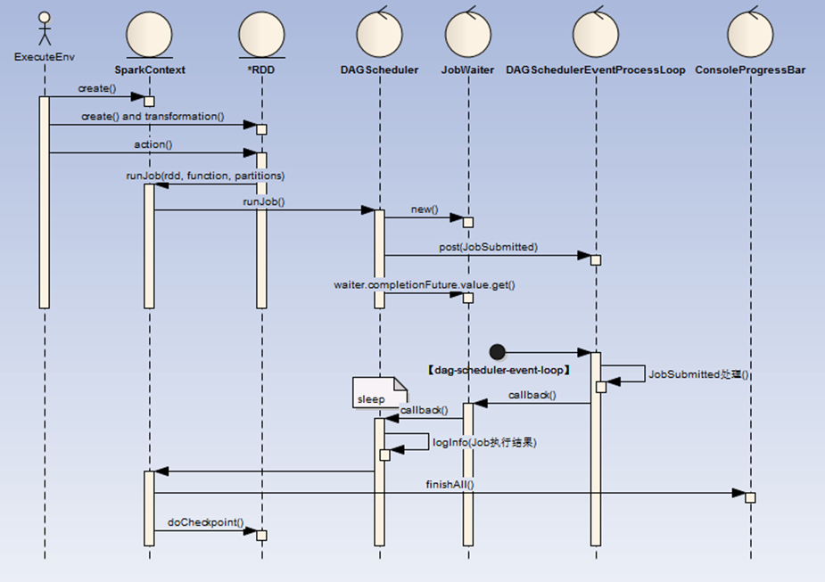

# 代码转换为初始RDDs

我们的用户代码通过调用 Spark 的 Api（比如：SparkSession.builder.appName("Spark Pi").getOrCreate()），该Api会创建 Spark 的上下文（SparkContext）,当我们调用transform类方法 （如：parallelize(),map()）都会创建（或者装饰已有的） Spark数据结构（RDD）, 如果是action类操作（如：reduce()），那么将最后封装的RDD作为一次Job提交，存入待调度队列中（DAGSchedulerEventProcessLoop ）待后续异步处理。

如果多次调用action类操作，那么封装的多个RDD作为多个Job提交。

流程如下：

ExecuteEnv(执行环境)

* 1.这里可以是通过spark-submit提交的MainClass, 也可以spark-shell 脚本。

* 2.**MainClass**: 代码中必定会创建或者获取一个 SparkContext。

* 3.**spark-shell**: 默认会创建一个 SparkContext

RDD（弹性分布式数据集）

* 1.create：可以直接创建（如：sc.parallelize(1 until n, slices) ）,也可以在其他地方读取（如：sc.textFile("README.md")）等

* 2.transformation：rdd提供了一组api可以进行对已有RDD进行反复封装成为新的RDD，这里采用的是装饰者设计模式

* 3.action:当调用RDD的action类操作方法时（collect、reduce、lookup、save ），这触发DAGScheduler的Job提交

* 4.DAGScheduler：创建一个名为JobSubmitted的消息至DAGSchedulerEventProcessLoop阻塞消息队列（LinkedBlockingDeque）中

* 5.DAGSchedulerEventProcessLoop：启动名为【dag-scheduler-event-loop】的线程实时消费消息队列

* 6.【dag-scheduler-event-loop】处理完成后回调JobWaiter

* 7.DAGScheduler：打印Job执行结果

* 8.JobSubmitted：相关代码如下（其中jobId为DAGScheduler全局递增Id）：

