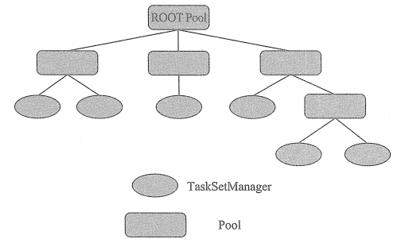
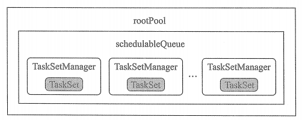
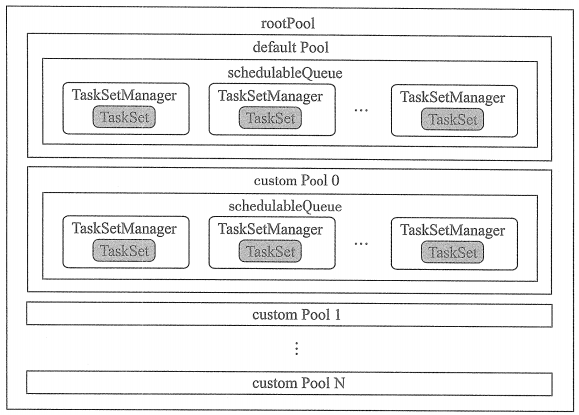

# 调度池Pool

TaskSchedulerImpl 对Task的调度依赖于调度池Pool,所以需要被调度的 TaskSet 都被置于调度池中。调度池Pool 通过调度算法对每个 TaskSet 进行调度，并将被调度的TaskSet交给 TaskSchedulerImpl 进行资源调度。

## 调度队列的层次关系

## FIFOSchedulableBuilder 构建的调度池的内存结构

## FairSchedulableBuilder 构建的调度池的内存结构

