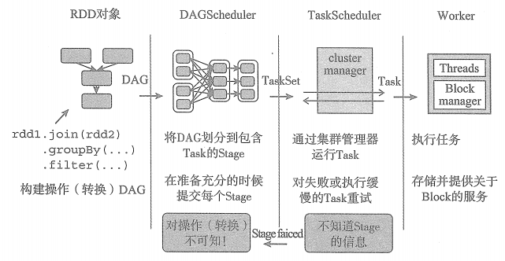

# 调度系统概述

Spark资源调度分为两层：

* 第一层是Cluster Manager，将资源分配给Application;

* 第二层是Application，进一步将资源分配给Application的各个Task。

# 调度系统主要工作流程



* **1.build operator DAG** : 用户提交的Job将首先被转换为一系列RDD并通过RDD之间的依赖关系构建DAG，然后将RDD构成的DAG提交到调度系统。

* **2.split graph into stages of tasks** : DAGScheduler 负责接收由RDD构成的DAG，将一系列RDD划分为不同的Stage。根据Stage的不同类型（目前有ResultStage 和 ShuffleMapStage 两种）, 给Stage中位完成的Partition 创建不同类型的Task（目前有ResultTask 和 ShuffleMapStask 两种），每个Stage将因为未完成Partition的多少，创建零到多个Task。 DAGScheduler最后将每个Stage中的Task以任务集合（TaskSet）的形式提交给Task Scheduler继续处理。

* **3.launch tasks via cluster manager** : 使用集群管理器（cluster manager）分配资源给任务调度，对于失败的任务还会有一定的重试与容错机制。TaskScheduler负责从DAGScheduler接收TaskSet，创建TaskSetManager对TaskSet进行管理，并将此TaskSetManager添加到调度系统中，最后将对Task的调度交给调度后端接口（SchedulerBackend）处理。SchedulerBackend首先申请TaskScheduler,按照Task调度算法（目前有FIFO和FAIR两种）对调度池中的所有TaskSetManager进行排序，然后对TaskSet按照最大本地性原则分配资源，最后在各个分配的节点上运行TaskSet中的Task。

* **4.execute tasks** : 执行任务，并将任务黄总监结果和最终结果存入存储体系。

```
注意：以上介绍的4个步骤中，严格来讲只有第2步和第3步属于调度系统的范畴，第1步是将作业提交给调度系统前的准备工作，  
第4步也和调度系统有很多关系，例如，map任务执行成功后将唤醒下游的reduce任务。
```