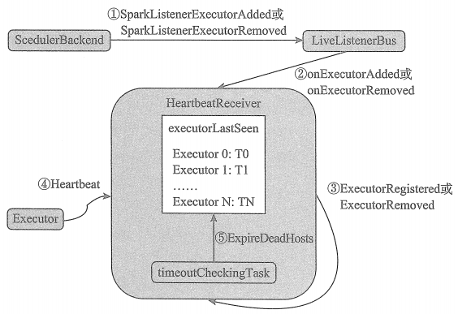

# HeartbeatReceiver的工作原理

HeartbeatReceiver 运行在 Driver 上，用以接收各个 Executor 的心跳消息，对各个Executor的“生死”进行监控。

①当SchedulerBackend 已经创建或注册了Executor后， SchedulerBackend 将向LiveListenerBus 投递 SparkListenerExecutorAdded 事件，当 Executor 与集群断开连接后， SchedulerBackend 将向LiveListenerBus 投递SparkListenerExecutorRemoved事件。  

②由于 HeartbeatReceiver 也实现了 SparkListener, 因此 LiveListenerBus 内部的异步线程在处理事件时，如果发现事件是 SparkListenerExecutorAdded 或 SparkListenerExecutorRemoved， 将调用 HeartbeatReceiver 的 onExecutorAdded 或 onExecutorRemoved 方法。

③当调用 HeartbeatReceiver 的 onExecutorAdded 或 onExecutorRemoved 方法时，HeartbeatReceiver将向自己发送 ExecutorRegistered 消息或 ExecutorRemoved消息。HeartbeatReceiver 接收到 ExecutorRegistered消息，将把 Executor 的身份标识和当前系统时间作为对偶放入到 executorLastSeen 缓存中。 HeartbeatReceiver 接收到 ExecutorRemoved 消息，将把 Executor 的身份标识和对应的系统时间从 executorLastSeen 缓存中清除。

④Executor 将不断向 HeartbeatReceiver 发送 Heartbeat消息，HeartbeatReceiver接收到 Heartbeat消息后， 将更新 executorLastSeen 缓存中 Executor 的身份标识对应的时间为系统当前时间。

⑤HeartbeatReceiver 内部的检查 Executor 超时的定时任务， 每隔一段时间将向 HeartbeatReceiver 自身发送 ExpireDeadHosts 消息，HeartbeatReceiver接收到 ExpireDeadHosts 消息后， 进行多项处理，移除丢失的Executor、对Executor 上正在运行的 Task 重新分配资源后进行调度、kill 丢失的 Executor、从 executorLastSeen 中移除此Executor。

