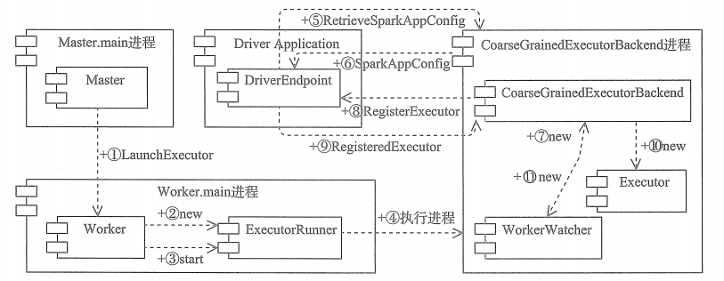

# Standalone部署模式下Executor的分配过程

* ①Master的schedule方法在对资源调度时将调用startExecutorsOnWorkers方法对Executor的资源进行分配和调度，然后通过向Worker发送LaunchExecutor消息运行Executor。

* ②Worker接收到LauncherExecutor消息后将创建ExecutorRunner。

* ③Worker创建完ExecutorRunner后，将调用ExecutorRunner的start方法。

* ④ExecutorRunner的start方法主要创建了线程workerThread，线程workerThread将构建并启动ProcessBuilder。由于ProcessBuilder的命令中指定了Java进程的主方法是CoarseGrainedExecutorBackend的伴生对象的main函数，因此将启动执行CoarseGrainedExecutorBackend的main函数进程。

* ⑤CoarseGrainedExecutorBackend的main函数的进程首先创建名为driverPropsFetcher的RpcEnv，然后向DriverEndpoint发送RetrieveSparkAppConfig消息。

* ⑥DriverEndpoint接收到RetrieveSparkAppConfig消息后，将向执行CoarseGrainedExecutorBackend的main函数的进程回复SparkAppConfig消息。SparkAPPConfig消息携带着Spark属性信息和分配给Executor的秘钥。

* ⑦CoarseGrainedExecutorBackend的main函数的进程收到SparkAppConfig消息后，将首先创建SparkConf和SparkEnv，然后创建CoarseGrainedExecutorBackend实例并注册到Executor自身的SparkEnv的RpcEnv。

* ⑧将CoarseGrainedExecutorBackend实例并注册到Executor自身的SparkEnv的RpcEnv时，会触发对CoarseGrainedExecutorBackend的onStart方法的调用，进而向DriverEndpoint发送RegisterExecutor消息以注册Executor。

* ⑨DriverEndpoint接收到RegisterExecutor消息对Executor注册成功后，将向CoarseGrainedExecutorBackend实例回复RegisteredExecutor消息。

* ⑩CoarseGrainedExecutorBackend实例接收到RegisterExecutor消息后将创建Executor。

* 11.CoarseGrainedExecutorBackend的main函数的进程收到SparkAppConfig消息后，除了创建CoarseGrainedExecutorBackend实例，还将创建WorkerWatcher，以保证执行CoarseGrainedExecutorBackend的main函数的进程在与Worker断开连接或发生网络错误的情况下推出。

